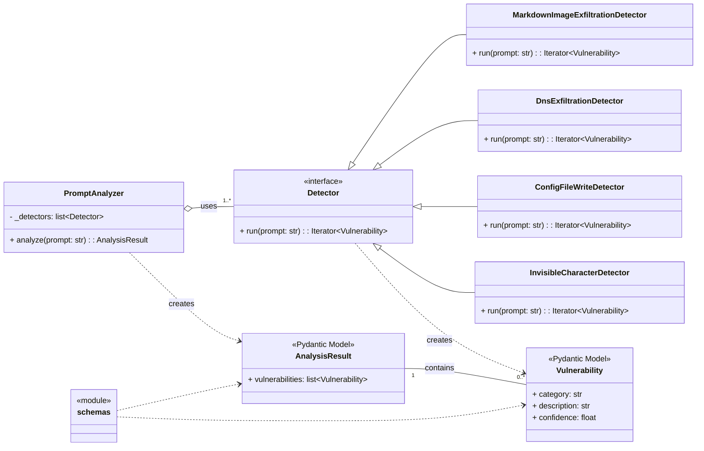
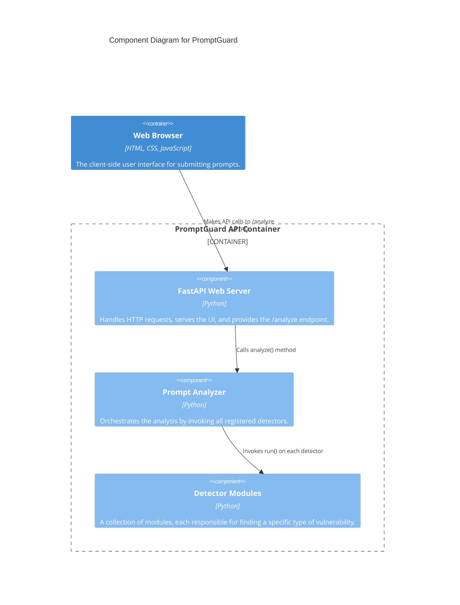
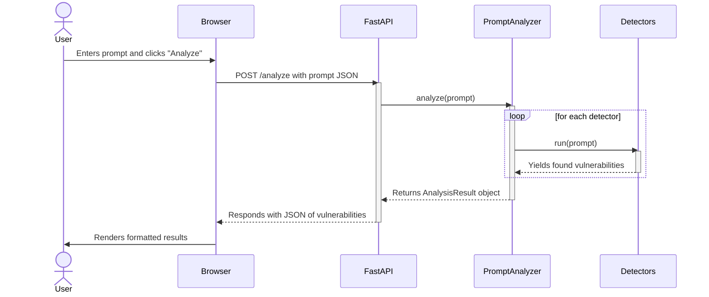
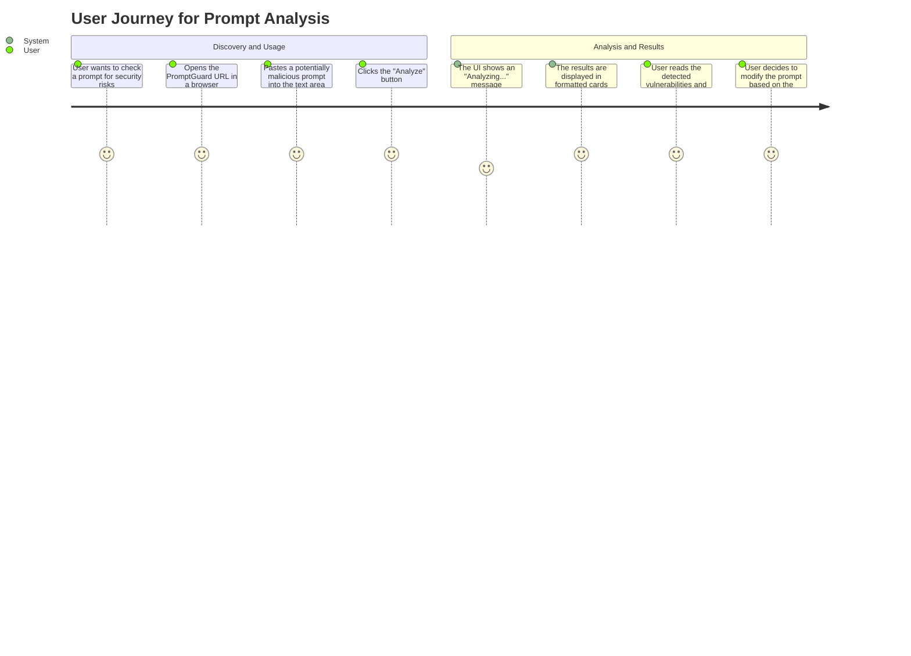
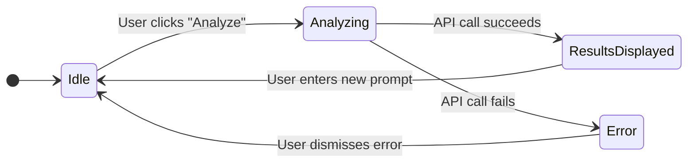

# PromptGuard Design Documentation

This document contains a series of diagrams that describe the architecture, data flow, and user interaction of the PromptGuard application. The diagrams are generated using Mermaid.

## 1. Class Diagram

This diagram shows the main classes in the `prompt_guard` application and their relationships. It highlights the modular design, where the `PromptAnalyzer` uses a collection of `Detector` classes to perform its analysis.

---

## 2. C4 Component Diagram

The C4 model helps to visualize the software architecture at different levels of detail. A Component Diagram is perfect for showing the major building blocks of the `PromptGuard` system.

---

## 3. Sequence Diagram

This diagram illustrates the sequence of interactions that occur when a user submits a prompt for analysis, from the web browser to the individual detectors.

---

## 4. User Journey Map

This diagram provides a high-level overview of the user's experience, from discovering the tool to understanding the results of their prompt analysis.

---

## 5. State Diagram

A State Diagram is useful for objects with complex, defined states. In our application, the `PromptAnalyzer` itself is stateless (it doesn't change based on previous requests). However, we can model the state of the *UI* during the analysis process.

